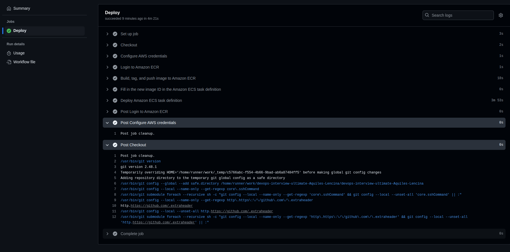

# Prueba 3 - CI/CD 

Dockerizar un nginx con el index.html default. Elaborar un pipeline que ante cada cambio realizado sobre el index.html buildee la nueva imagen y la actualize en la plataforma elegida. (docker-compose, swarm, kuberenetes, etc.) Para la creacion del CI/CD se puede utilizar cualquier plataforma (CircleCI, Gitlab, Github, Bitbucket.)

## Descripción de archivos utilizados

### Dockerfile

dockerfile que contiene las instrucciones para construir la imagen de Docker del nginx.

### index.html

Archivo html que se utilizara para el despliegue del nginx.

### task-definiton.json

Archivo que contiene la definicion de la tarea que se utilizara en ECS, obtenidas de aws.

### aws.yml

Archivo que contiene la definicion de la infraestructura que se utilizara en AWS utilizando variables definidas en github actions, siguiendo el template recomendado.

## Modo de uso

Para poder dispara el pipeline es necesario modificar el index.html hacer un push a la rama master o prueba-3, para ello se debe ejecutar el siguiente comando:

```bash
git add .
git commit -m "Modificacion index.html"
git push origin master
```

Luego se debe esperar a que el pipeline se ejecute y se despliegue la aplicacion en AWS.



Finalmente obtener la url de la aplicacion desplegada en AWS.
